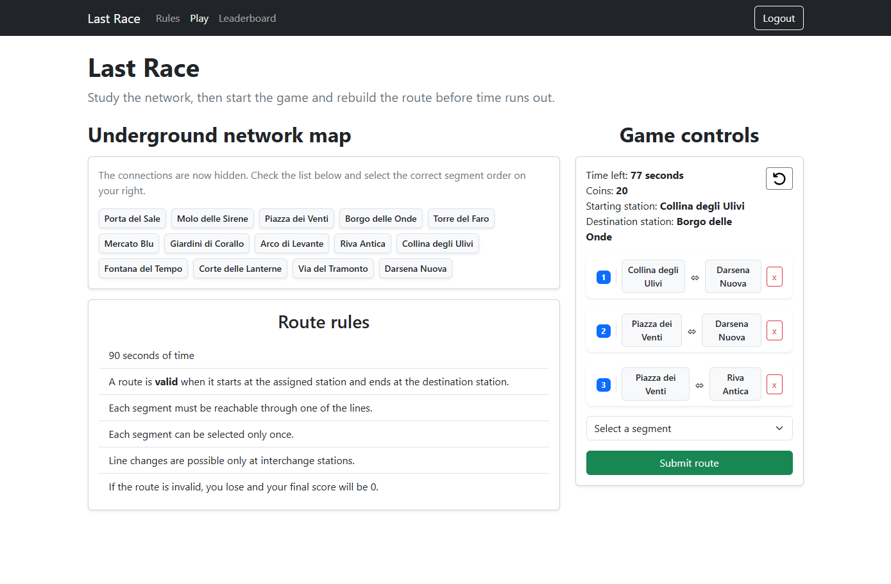
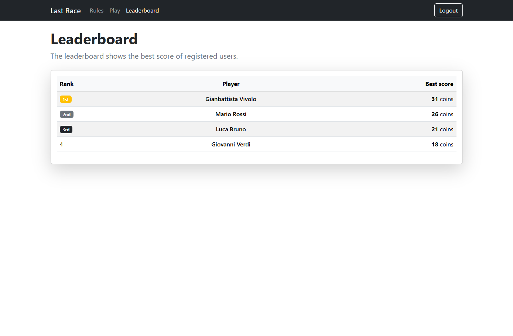

# Exam #1: "Last Race"

## Student: s360803 VIVOLO GIANBATTISTA

## React Client Application Routes

- Route `/`: Home page, showing the rules of the game. Anonymous users can read the rules and login. Logged in users can access the game and the leaderboard.
- Route `/login`: Login page, showing a form in which the user can insert their email and password and login.
- Route `/leaderboard`: Leaderboard page, showing the general ranking of the game. To access this page, the user must be authenticated.
- Route `/game`: Game page, allowing users to play a game. To access this page, the user must be authenticated.

## API Server

- POST `/api/sessions`
  - Request body:

  ```json
  {
    "email": "gb@gmail.com",
    "password": "password123"
  }
  ```

  On success it returns user info:

  ```json
  {
    "id": 1,
    "email": "gb@gmail.com",
    "name": "Gianbattista Vivolo"
  }
  ```

  On invalid credentials it returns a `401 Unauthorized` response.

- GET `/api/session/current`
  - request data
    Session cookie
  - response body content
    On success it returns user info:

  ```json
  {
    "id": 1,
    "email": "gb@gmail.com",
    "name": "Gianbattista Vivolo"
  }
  ```

  On invalid session it returns a `401 Unauthorized` response.

- DELETE `/api/session/current`
  - request data
    Session cookie
  - response
    `204 No Content`

- GET `/api/network/complete`
  - request data
    Session cookie
  - response
    The complete underground network, with stations, lines and ordered stations:
    ```json
    {
      "stations": [{"id": 1,"name": "..." },...],
      "lines": [{"id": 1,"name": "..." },...],
      "linesStations": [{"lineId":1,"stationsIds": [1,2,3,...]}]
    }
    ```

- GET `/api/network/segments`
  - request data
    Session cookie
  - response
    The list of all available segments, represented as pairs of connected stations
    ```json
    [
      {
        "from": 1,
        "to": 2
      }
    ]
    ```

- POST `/api/games/start`
  - request data
    Session cookie
  - response
    Creates a new game choosing a random start and destination station
    ```json
    {
      "gameId": 1,
      "startedAt": "2026-06-22T10:00:00.000Z",
      "startStationId": 1,
      "destinationStationId": 5
    }
    ```
- POST `/api/games/:gameId/validate`
  - request data
    Session cookie
  - request params
    `gameId`: identifies the game to validate
  - request body
    ```json
    {
      "segments": [
        {
          "from": 1,
          "to": 2
        },
        {
          "from": 2,
          "to": 5
        }
      ]
    }
    ```
  - response
    Server checks if the route is valid, the elapsed time and randomly assigns one event to each segment, calculating the score.
    On success:
    ```json
    {
      "isRouteValid": true,
      "events": [
        {
          "segment": {
            "from": 1,
            "to": 2
          },
          "drawnEvent": {
            "id": 1,
            "name": "Quiet journey",
            "description": "Nothing unexpected happened.",
            "pointsWorth": 0
          },
          "scoreAfterEvent": 20
        }
      ],
      "finalScore": 20
    }
    ```
    On invalid route:
    ```json
    {
      "isRouteValid": false,
      "events": [],
      "finalScore": 0
    }
    ```
- GET `/api/leaderboard`
  - request data
    Session cookie
  - response
    Best score achieved by each player in descending order.
    ```json
    [
      {
        "userId": 1,
        "userName": "Gianbattista Vivolo",
        "score": 24
      }
    ]
    ```

## Database Tables

- Table `users` - contains user data: id, email, name, password hash and password salt. A `User` is uniquely identified by email
- Table `stations` - contains stations data: id, name. A `Station` is uniquely identified by its id.
- Table `lines` - contains lines data: id, name. A `Lines` is uniquely identified by its id.
- Table `line_stations` - contains intermediate data about a line and its connected stations: line_id, station_id, stop_order. A `line_station` is uniquely identified by line_id and station_id. `stop_order` represents the order of the stop in the line.
- Table `events` - contains events data: id, name, description and points_worth. An `Event` is uniquely identified by its id, and the field `points_worth` can have a value between [-4; +4].
- Table `games` - contains games data: id, user_id, start_station_id, destination_station_id, score, started_at and completed_at. A `game` is uniquely identified by its id, and score must be greater than 0. Also, start_station_id cannot be the same as destination_station_id, and user_id is a foreign key and must be the id of an user, same for start_station_id and destination_station_id.

## Main React Components

- `App` (in `App.jsx`): Entry point that manages user state and defines the routes.
- `Header` (in `components/Header.jsx`): Displays the navigations links and the login or logout button.
- `LoginButton` (in `components/LoginButton.jsx`): Button that can be user to redirect to the login page.
- `LogoutButton` (in `components/LogoutButton.jsx`): Button that logs out the authenticated user and updates the auth state.
- `GamePhases` (in `components/GamePhases.jsx`): Components that describe the various phases of the game.
- `icons` (in `components/icons/*.jsx`): Components that are used as icons (svg).
- `GameControls` (in `components/game/GameControls.jsx`): Used during the first two phases of the game. This component shows the game state: assigned start and destination stations, starting coins, time left, and the possible segments that the user can choose from. It automatically submits the route when time expires.
- `SetupPhase` (in `components/SetupPhase.jsx`): Shows the complete network, including stations, connections and lines.
- `PlanningPhase` (in `components/PlanningPhase.jsx`): Shows the names of the stations and nothing more. Used during the planning phase of the game.
- `ExecutionPhase` (in `components/ExecutionPhase.jsx`): Shows each segment of the selected route and which event was chosen, including its effect on the final score.
- `ResultPhase` (in `components/ResultPhase.jsx`): Shows the final result of the game, including if the submitted route was valid.

### Pages

- `HomePage` (in `pages/HomePage.jsx`): Shows the game rules and it allows users to login.
- `LeaderboardPage` (in `pages/LeaderboardPage.jsx`): Shows the game leaderboard, consisting of the best score achieved by each registered user.
- `GamePage` (in `pages/GamePage.jsx`): Shows the game page, where registered users can start a game.
- `LoginPage` (in `pages/LoginPage.jsx`): Shows the login form

## Screenshot




## Users Credentials

- email: "mario@gmail.com", password: "password123"
- email: "giovanni@gmail.com", password: "password123"
- email: "luca@gmail.com", password: "password123"
- email: "gb@gmail.com", password: "password123" (No games played yet)

## Use of AI Tools

Used AI to:

- Generate events (names and descriptions)
- Generate stations and lines, along with their connections
- Explain how to correctly choose starting and destination stations.
